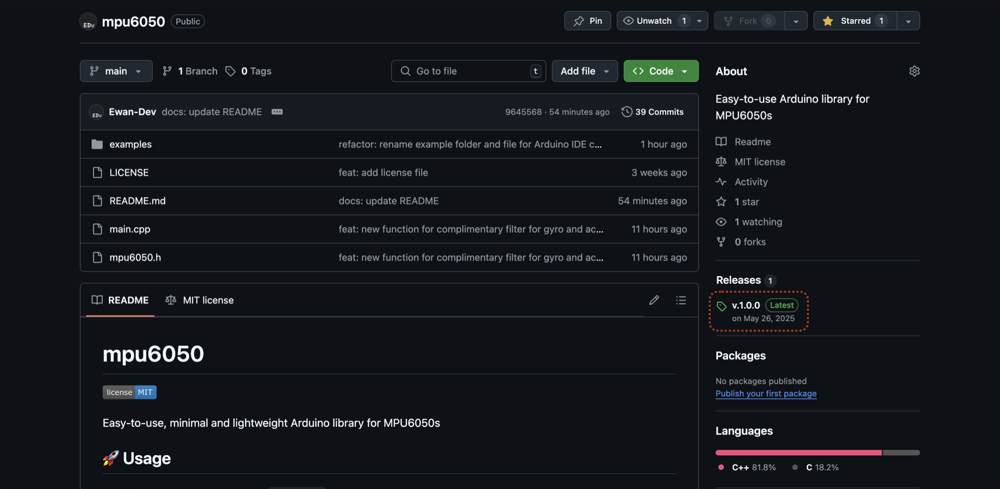
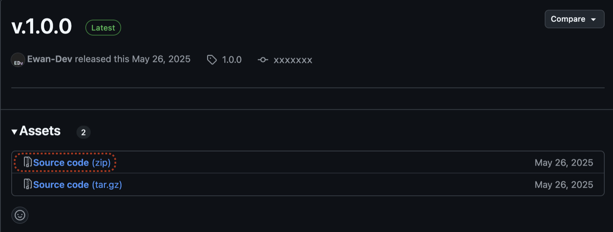
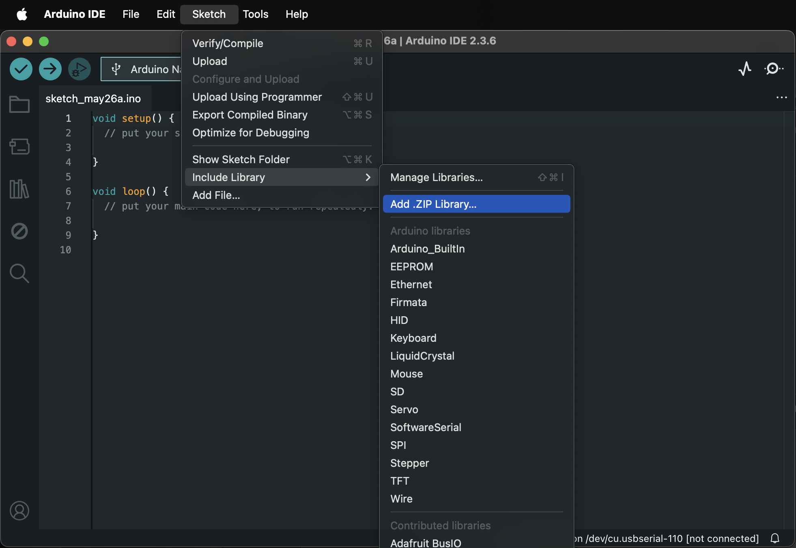
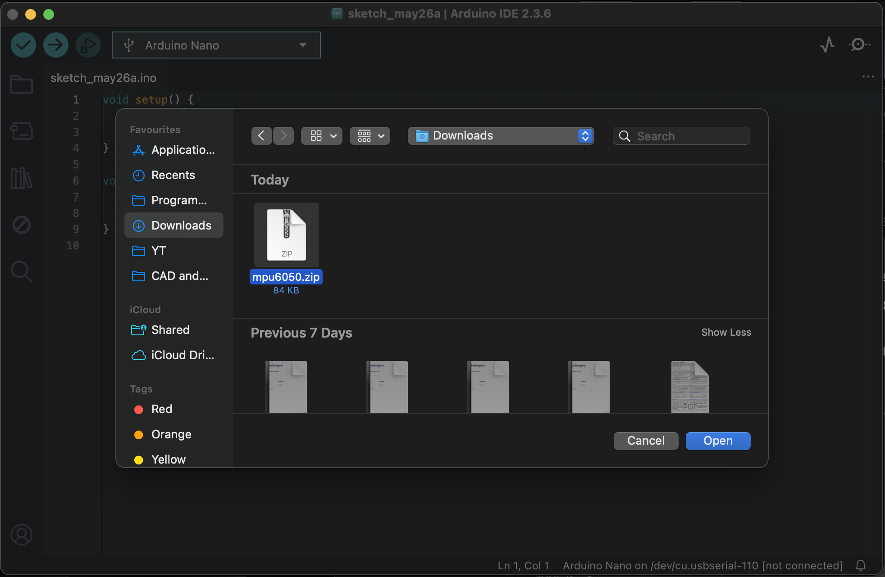
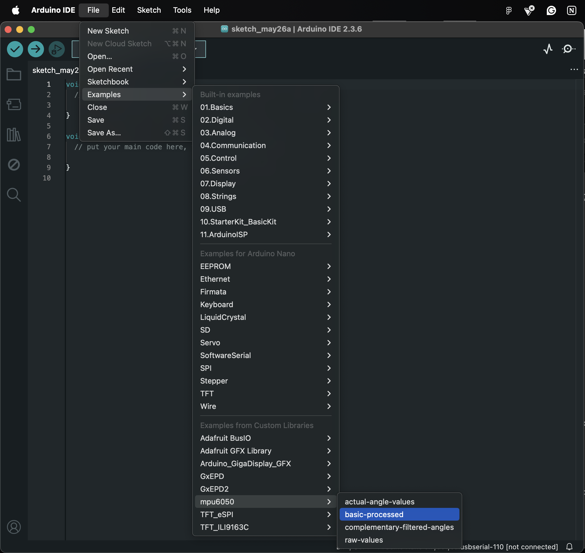
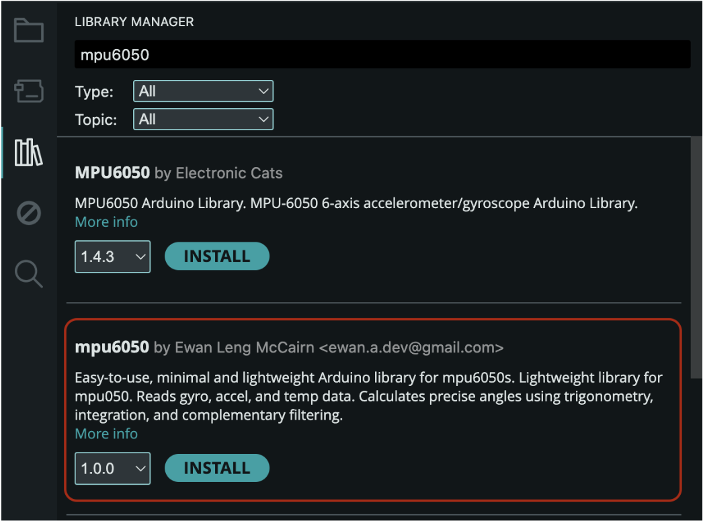

# mpu6050


*Easy-to-use, minimal and lightweight Arduino library for MPU6050s*

## 📚 Table of Contents

- [Overview](#-overview)
- [Installation](#-installation)
- [Usage](#-usage)
- [Function Reference](#-function-reference)
    - [I2C Error Code Reference](#-i2c-error-code-reference)
    - [Functions](#-functions)
        - [Setup](#-setup)
        - [Read Raw Values](#-read-raw-values)
        - [Process Raw Values](#-process-raw-values)
- [Tested With](#-tested-with)
- [License](#-license)

## 🔍 Overview
Quick and easy to download, set up and use for any MPU6050 project. Reads gyroscope, accelerometer and temperature data. Trigonometry, integration, formulae and complementary filters are used to calculate angles to precision.

## 💾 Installation 

### 1. Click on latest release in 'releases' section of sidebar


### 2. Click on `.zip` file


### 3. Go to Arduino IDE and navigate through `Sketch > Include Library > Add. ZIP Library`


### 4. Open the zip file (`mpu6050.zip`)


### 5. Allow the library to download
You should get a small message to indicate successful download. Now close the Arduino IDE and reopen for the library for the library to appear.

### 6. You're all set! 🙌
You can now use the library and its examples by either using the examples by navigating through `File > Examples > mpu6050 > [EXAMPLE FILE]`, or using the documentation below.



### Or install through the Arduino IDE Library Manager



## 🚀 Usage 
Begin with `#include <mpu6050.h>` and use documentation below or use example code.

For full example code, check the [`examples/`](./examples) folder.

## 🧑‍💻 Function reference 
### 🚨 I2C Error Code Reference
When a function returns an I2C error code, here is the reference:
 ```cpp
 DATA_TOO_LONG_FOR_TRANSMIT_BUFFER = 1,
 ADDRESS_TRANSMITaa_NACK = 2,
 DATA_TRANSMIT_NACK = 3,
 OTHER_ERROR = 4,
 TIMEOUT = 5
```


## 📖 Functions
###  🔧 Setup
#### `wakeSensor(address);`
- **Parameters**:
  - ```uint8_t address``` – The address of the sensor. (`0x68`or `0x69`)
- **Returns**: I2C error code or 0 (success).
---
###  📉 Read raw values
#### `readGyroData(address, gX, gY, gZ);`
- **Parameters**:
  - `uint8_t address` – The address of the sensor.
  - `float gX, gY, gZ` – Variables passed by reference to store gyroscope values for X, Y, and Z axes.
- **Returns**: I2C error code  or 0 (success).

#### `readAccelData(address, aX, aY, aZ);`
- **Parameters**:
  - `uint8_t address` – The address of the sensor.
  - `float aX, aY, aZ` – Variables passed by reference to store acceleration values for X, Y, and Z axes.
- **Returns**: I2C error code  or 0 (success).

#### `readTempData(address, temp);`
- **Parameters**:
  - `uint8_t address` – The address of the sensor.
  - `float temp` – Variable passed by reference to store temperature value for chip temperature
- **Returns**: I2C error code or 0 (success).
---
###  🧮 Process raw values
#### `rawGyroToDPS(rawGX, rawGY, rawGZ,  dpsGX, dpsGY, dpsGZ);`
- **Parameters**:
  - `float rawGX, rawGY, rawGZ` – Variables passed that already store raw gyroscope values for X, Y, and Z axes.
  - `float dpsGX, dpsGY, dpsGZ` – Variables passed by reference to store processed gyroscope values in dps (degrees per second) for X, Y, and Z axes.
- **Returns**: 0 (success)

#### `rawAccelToGForce(rawAX, rawAY, rawAZ,  gForceAX, gForceAY, gForceAZ);`
- **Parameters**:
  - `float rawAX, rawAY, rawAZ` – Variables passed that already store raw accelerometer values for X, Y, and Z axes.
  - `float gForceAX, gForceAY, gForceAZ` – Variables passed by reference to store processed accelerometer values in g force for X, Y, and Z axes.
- **Returns**: 0 (success)

#### `dpsToAngles(dpsGX, dpsGY, dpsGZ, pitch, roll, yaw);`
- **Parameters**:
  - `float dpsGX, dpsGY, dpsGZ` – Variables passed that already store dps gyroscope for X, Y, and Z axes.
  - `float absGX, absGY, absGZ` – Variables passed by reference to store processed dps values in actual angles for X, Y, and Z axes.
- **Returns**: 0 (success)

#### `calculateGyroOffset(address, gyroOffsetX, gyroOffsetY, gyroOffsetZ);`
- **Parameters**:
  - `uint8_t address` – The address of the sensor.
  - `double gyroOffsetX, gyroOffsetY, gyroOffsetZ` – Variables passed by reference to store gyroscope offset for X, Y and Z axes.
- **Returns**: 0 (success)

#### `calculateAccelOffset(address, accelOffsetX, accelOffsetY);`
- **Parameters**:
    - `uint8_t address` – The address of the sensor.
    - `double accelOffsetX, accelOffsetY` – Variables passed by reference to store accelerometer offset for X and Y axes
- **Returns**: 0 (success)

#### `calculateAnglesFromAccel(gForceAX, gForceAY, gForceAZ, pitch, roll);`
  Uses trigonometry to find pitch and roll from accelerometer values.
- **Parameters**:
  - `float gForceAX, gForceAY, gForceAZ` – Variables passed that already store accelerometer g force for X, Y and Z axes.
  - `float roll, pitch` – Variables passed by reference to store accelerometer roll and pitch values.
- **Returns**: 0 (success)

#### `complementaryFilter(dpsGyro, accelAngle, alpha, deltaTime, filteredAngle);`
- **Parameters**:
    > **⚠️ Important:**
  > ensure that both `dpsGyro` and `accelAngle` are values of the same axis
  
  - `float dpsGyro` – Variable passed that already stores dps value from gyroscope.
  - `float accelAngle` – Variable passed that already stores pitch or roll found from accelerometer values with trigonometry.

  - `float alpha` -  Variable passed that already stores alpha value. The alpha value is how much the gyroscope values in the complementary filter are weighted. Most people use 0.95 - 0.98.

  
  >**A higher alpha value means:**  
  >| Advantages      | Disadvantages |
  >| ----------- | ----------- |
  >| quicker responsiveness      | more susceptible to gyro bias if offsets are inaccurate.       |
  >| less noise  |drifts more over time|

  - `float deltaTime` - Variable passed that already stores delta time value. The delta time value is the sampling rate. In other words, how much time it takes for one loop of the Arduino code to run. This is best done dynamically although it is not mandatory. An example of dynamic delta time calculation can be found in [`filtered-angles.ino`](./examples/complementary-filer/filtered-angles.ino)
  - `float filteredAngle` - Variable passed by reference to store filtered pitch or roll values.

- **Returns**: 0 (success)

## ✅ Tested With
No reason for this not to work on all Arduino architectures unless it doesn't support I2C. It has been tested successfully with:
- Arduino Uno
- Arduino Nano
- MPU6050 (GY-521 breakout board)
- Arduino IDE 2.3.6

If you get this working on another architecture, feel free to pull request or share your setup in the discussions tab to expand its tested compatability.


## ⚖️ License
This project is licensed under the MIT License - see the [LICENSE](LICENSE) file for details.
